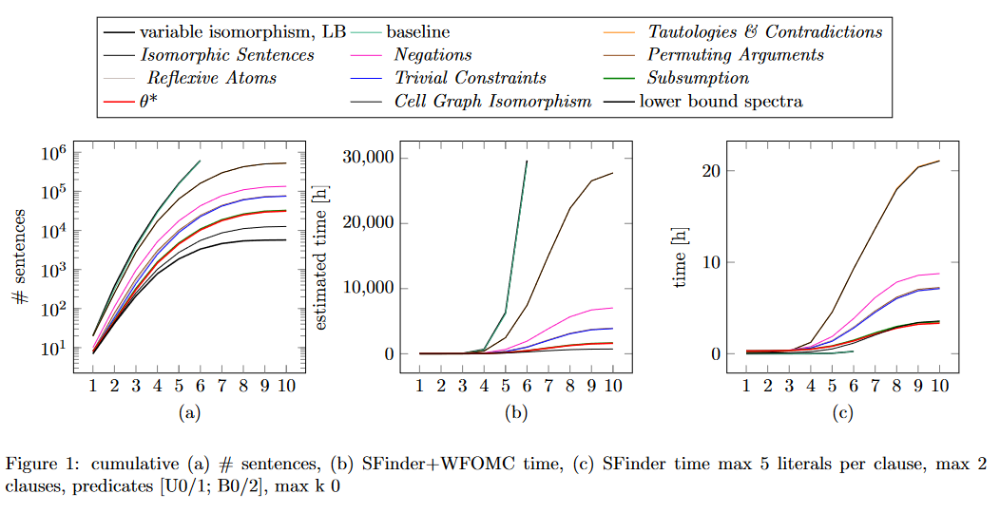

This folder contains a prototypical infrastructure to run SFinder and visualize its output. In addition, the folder 
`run5` contains results of experiments in the second publication, i.e., version 1.x.y. Earlier experiments, i.e., the ones
from the original IJCAI'23 by version 0.x.y, are not included here since that version was slower and contained a slightly
different approach to utilizing the pruning techniques.

Running experiments
-------------------

Reproducing the experiments is as easy as running a java command, e.g.
```
    java -Xms5g -Xmx50g -Dida.sentenceSetup.timeLimit=2880 -Dida.sentenceSetup.maxOverallLiterals=6 
         -Dida.sentenceSetup.maxClauses=2 -Dida.sentenceSetup.maxLiteralsPerClause=3 -Dida.sentenceSetup.unaryPredicates=2
         -Dida.sentenceSetup.binaryPredicates=2 -Dida.sentenceSetup.quantifiers=true -Dida.sentenceSetup.maxK=1 
         -Dida.sentenceSetup.maxCountingClauses=2 -Dida.sentenceSetup.maxLiteralsPerCountingClause=1 
         -Dida.sentenceSetup.doubleCountingExist=false -Dida.sentenceSetup.prover9Path=none 
         -Dida.sentenceSetup.maxProver9Seconds=30 -Dida.sentenceSetup.naiveTautology=false 
         -Dida.sentenceSetup.tautologyFilter=false -Dida.sentenceSetup.contradictionFilter=false 
         -Dida.sentenceSetup.countingContradictionFilter=false -Dida.sentenceSetup.decomposableComponents=false 
         -Dida.sentenceSetup.isomorphicSentences=false -Dida.sentenceSetup.negations=false 
         -Dida.sentenceSetup.permutingArguments=false -Dida.sentenceSetup.reflexiveAtoms=false 
         -Dida.sentenceSetup.subsumption=false -Dida.sentenceSetup.quantifiersReducibility=false 
         -Dida.sentenceSetup.trivialConstraints=false -Dida.sentenceSetup.cellGraph=none 
         -Djava.util.concurrent.ForkJoinPool.common.parallelism=10 -Dida.sentenceSetup.statesStore=false 
         -Dida.sentenceSetup.juliaThreads=30 
         -jar /home/MY_USER_NAME/SentenceFinder/SFinder.jar > prefix1-order4-3-2--1-2-2-1/0baseline.txt
```

However, to reproduce the experiments, one would have to alter this command multiple times which is undesired. Hence, 
one may use the `slurmKicker.py` script which generates instances that does the altering of the command above. However,
one has to firstly accommodate the script to his environment. Assuming you have downloaded the repo into 
`/home/MY_USER_NAME/SentenceFinder` folder, you just have to replace with your username; otherwise you have to change the path.
Similarly, you may set up all remaining default values, e.g., `PATH_TO_JULIA_SCRIPT`, `N_JULIA_THREADS`, `PATH_TO_PROVER9`,
etc. There are two more things to set up -- Java and Julia -- that are needed to be on the path. In case you are running 
a local machine, you may probably drop lines 141 `"ml Java/17.0.4\n"` and 145 `f"julia {PATH_TO_JULIA_INSTALL}\n"`. If 
you are running on a cloud where Java and Julia are not on the path and you need to lead the modules beforehand, just 
accommodate these two lines according to your environment.

After doing all of this, you need a python >= 3.10 environment with Pandas, typer, and typing packages to run the script,
e.g.
```
    python slurmKicker.py --maxliterals 3 --name prefix1 --maxlayers 3 > prefix1.sh
```
with the possibility of setting max clauses, max available memory, number of unary and binary predicates. A more detailed 
altering of the setup must be done via altering the `slurmKicker.py` script, e.g., order of the pruning techniques.

Finally, running all the slurm's tasks is easy as `./prefix1.sh`. Resulting std outputs will be in the newly created 
folders where names correspond to the setup, e.g., number of unary predicates, etc.

Aggregating results
-------------------

To visualize results, you can use the `grabber.py` script. To aggregate the spectra-computation time, which was shown
in the paper, we also need a statistics on the time requirement per sentences -- that is where the csv file comes in 
action. Firstly, you have to unzip the rar archive to get the csv file which is too large to be pushed to github. In the
paper, the default time limit per spectrum was 5 minutes, hence the value of `MAX_TIME` variable in the file.

To get the same plots, just run the script with the same setup as you did for the experiments generation, i.e.
```
    python grabber.py --source run5 --name fo52-order4 --maxliterals 5 --maxclauses 2 --maxlayers 10 --unarypredicates 1 --binarypredicates 1 --k 0
```

The `source` parameter is just a folder that contains a particular folder with all experiments with the same setting 
that are to be compared -- to be precise, only the number of pruning techniques differs, the rest of parameters, e.g., 
the number of predicates, stay the same over all of these (hence, e.g., `prefix1` experiments). The rest of the 
parameters are the same as above. The results are displayed in Latex using TikZ package.

